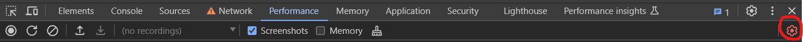
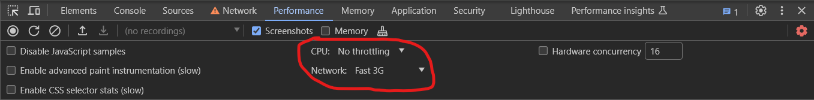
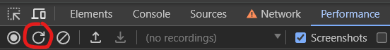
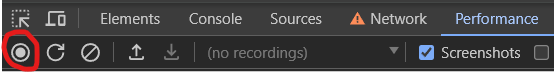

# Aufgabe 3 - Performance vergleich

Nutzt den Chrome Performance Tab um die Performance der verschiedenen Anwendungen zu Vergleichen.
Die Anwendungen werden mit `docker compose up -d gestartet`.

- Pre-Rendering: [localhost:8080](http://localhost:8080)
- CSR: [localhost:8081](http://localhost:8081)
- SSR: [localhost:8082](http://localhost:8082)

Nutzt beim Vergleichen der Performance unterschiedliches Network und CPU Throttling. 

Um das Throttling anzupassen, muss im Performance Tab das rote Zahnrad ausgewählt werden (Siehe rote Markierung).

Dann kann CPU und Network Throttling angepasst werden (Siehe rote Markierung)

## A) Vergleich der Initialen Ladezeiten.
Die Performance bei initialen Laden muss verglichen werden. Dafür muss im Performance Tab der Reload-Button angeklickt
werden (Siehe roter Kreis).

## B) Vergleich der In-App-Navigation
Jetzt soll die Performance beim Navigieren in der App aufgezeichnet und verglichen werden. Dafür muss der Record-Button
angeklickt werden(Siehe roter Kreis).

